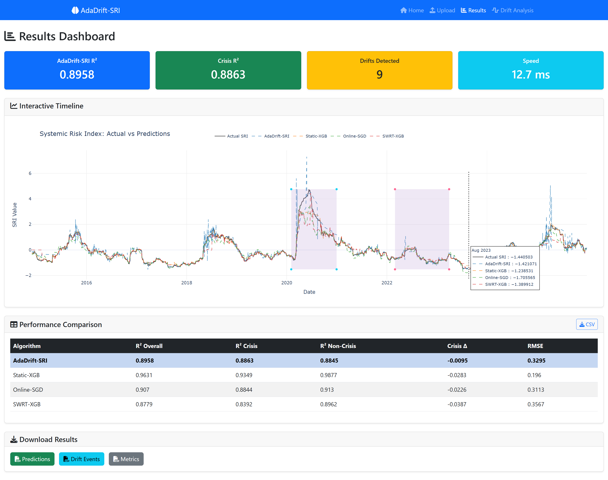

# 📊 AdaDrift-SRI: Adaptive Drift-Aware Online Learning Algorithm

[](https://www.python.org/)
[](https://opensource.org/licenses/MIT)
[](https://flask.palletsprojects.com/)

---

## 🔬 Overview

**AdaDrift-SRI** (Adaptive Drift-Aware Online Learning for Systemic Risk Index) is an adaptive machine learning algorithm for **non-stationary data streams** in financial surveillance. It combines real-time concept drift detection with warm-restart adaptation to maintain prediction accuracy during market regime changes.

### Key Innovation

Unlike traditional batch models that degrade during financial crises, AdaDrift-SRI **maintains or improves performance** during market distress by detecting distributional shifts and adaptively resetting its learner.

### Screenshot




---

## 📈 Results

| Metric | AdaDrift-SRI | Static-XGB | Online-SGD | SWRT-XGB |
|---|---|---|---|---|
| R² Overall | 0.8958 | 0.9631 | 0.9070 | 0.8779 |
| R² Crisis | 0.8863 | 0.9349 | 0.8844 | 0.8392 |
| Crisis Delta | **-0.0095** | -0.0283 | -0.0226 | -0.0387 |
| Drifts Detected | 9 | - | - | - |
| ms/obs | 13.23 | - | - | - |

> AdaDrift-SRI ranks #1 in crisis resilience with only 0.95% R² degradation.

### COVID-19 Adaptation

```
Drift #4: 2020-03-17 → Error 3.748 (Market crash)
Drift #5: 2020-05-26 → Error 3.113 (Adapting)
Drift #6: 2020-08-12 → Error 0.056 (Recovered)
```

> Error reduced by **98.5%** across 3 adaptation cycles.

---

## 🏗️ Architecture

Four integrated components:

| Component | Description | Complexity |
|---|---|---|
| **C1: Page-Hinkley** | Sequential drift detection | O(1) |
| **C2: HATR** | Incremental decision tree | O(log N) |
| **C3: SW Evaluator** | Rolling RMSE monitoring | O(W) |
| **C4: Warm-Restart** | Model reset on drift | O(1) |

```
Data Stream → [HATR Predict] → Prediction
                  ↓
           [PH Drift Detect]
                  ↓
             Drift? → Yes → [Warm-Restart]
                  ↓              ↓
                No          New Model
                  ↓
             Continue
```

---

## 🛡️ Data Leakage Controls

| Control | Status |
|---|---|
| Target excluded from features | ✅ |
| Scaler fitted on warm-up only | ✅ |
| No temporal overlap | ✅ |
| Prequential protocol | ✅ |
| SWRT scaler fixed | ✅ |
| Feature lags use past data | ✅ |

---

## 🚀 Quick Start

### Installation

```bash
git clone https://github.com/nonoheryana/AdaDrift-SRI.git
cd AdaDrift-SRI
pip install -r requirements.txt
```

### Dependencies

```
flask>=3.0.0
pandas>=2.1.0
numpy>=1.26.0
scikit-learn>=1.3.0
xgboost>=2.0.0
river>=0.21.0
plotly>=5.18.0
matplotlib>=3.8.0
scipy>=1.11.0
```

### Run Web Dashboard

```bash
python app.py
# Open http://localhost:5000
```

### Run CLI

```bash
python adadrift_cli.py --data dataset.csv --output ./results/
```

---

## 📊 Dataset Format

Required CSV columns:

| Column | Type | Description |
|---|---|---|
| `Date` | datetime | Observation date |
| `Systemic_Risk_Index` | float | Target variable |
| `Crisis_Period` | binary | 1=crisis, 0=normal |
| `Year` | int | Year identifier |
| `BBRI_Volatility` | float | Bank-specific feature |
| `Avg_Correlation` | float | Market-wide feature |

---

## 🖥️ Web Dashboard

| Page | Description |
|---|---|
| **Upload** | Drag-drop CSV, configure hyperparameters |
| **Training** | Real-time progress bar |
| **Results** | Interactive Plotly timeline, metrics table |
| **Drift Analysis** | Detailed drift events |
| **Download** | CSV export |

### Visualizations

- Cumulative R² progression
- Prediction vs Actual with crisis shading
- QQ-Plot error distribution
- Drift Timeline with markers
- Rolling RMSE with trend line
- Crisis vs Non-Crisis comparison
- Radar Chart multi-metric
- Computational Efficiency

---

## 🧪 Parameters

| Parameter | Default | Range | Description |
|---|---|---|---|
| `warmup_pct` | 0.30 | 0.10-0.50 | Warm-up size |
| `ph_lambda` | 40 | 10-200 | Drift threshold |
| `ph_delta` | 0.005 | 0.001-0.05 | Magnitude tolerance |
| `sw_window` | 60 | 20-200 | RMSE window |

---

## 📚 Theory

### Page-Hinkley Test
- False Alarm Rate controlled by lambda
- Detection Delay: O(1/delta²)
- Memory: O(1)

### Hoeffding Adaptive Tree
- Hoeffding Bound: epsilon = sqrt(R² ln(1/delta) / 2n)
- Grace Period: 50 observations
- Adaptive leaf: Perceptron + Mean

### Sliding Window
- Window size: 60 observations
- Rolling RMSE with linear trend

### Warm-Restart
- Trigger: PH alarm + min 30 obs
- Action: Reset HATR, keep scaler
- Convergence: 50-100 obs

---

## 📂 Project Structure

```
AdaDrift-SRI/
├── app.py                 # Flask web app
├── requirements.txt       # Dependencies
├── templates/             # HTML pages
│   ├── index.html
│   ├── upload.html
│   ├── training.html
│   ├── results.html
│   └── drift_analysis.html
├── static/css/            # Styles
├── uploads/               # Input data
└── outputs/               # Results
```

---

## 🎯 Applications

- Financial systemic risk monitoring
- Market regime change detection
- Real-time risk management
- Regulatory technology (RegTech)
- Crisis early warning systems

---

## ⚠️ Limitations

- Single-tree learner (not ensemble)
- Fixed hyperparameters
- Univariate drift detection

## 🔮 Future Work

- [ ] Ensemble HATR with voting
- [ ] Online hyperparameter tuning
- [ ] Multivariate drift detection
- [ ] Drift explanation module
- [ ] GPU acceleration
- [ ] REST API

---

## 📄 License

MIT License - see [LICENSE](LICENSE) file.

---

## 🙏 Acknowledgments

- [River ML](https://riverml.xyz) - Online learning
- [XGBoost](https://xgboost.readthedocs.io) - Gradient boosting
- [Plotly](https://plotly.com) - Interactive charts
- [Flask](https://flask.palletsprojects.com) - Web framework

---

<div align="center">

**⭐ Star this repo if you find it useful! ⭐**

</div>